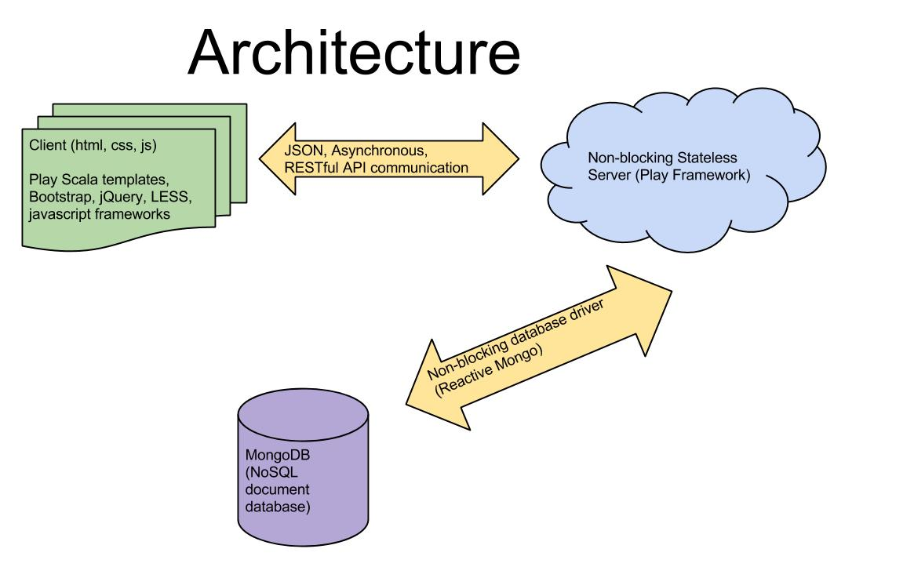
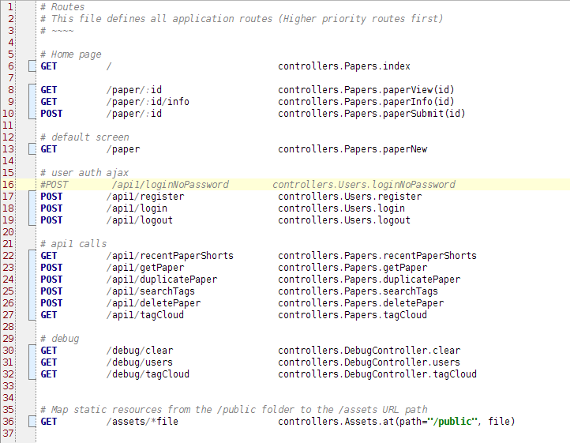
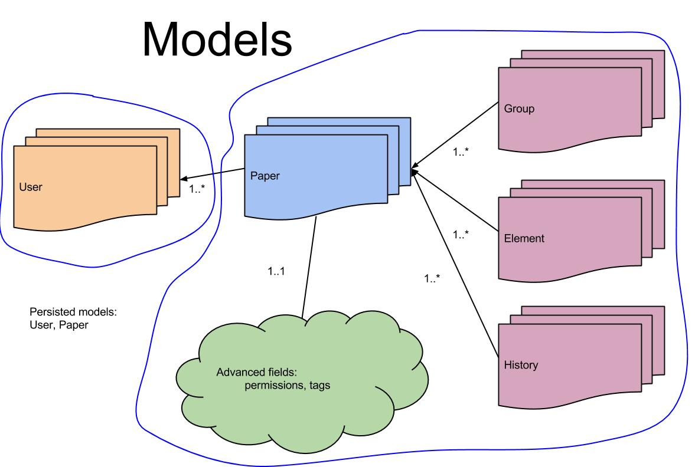
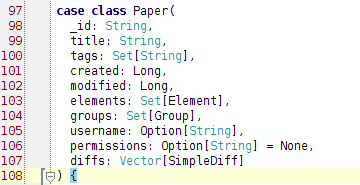
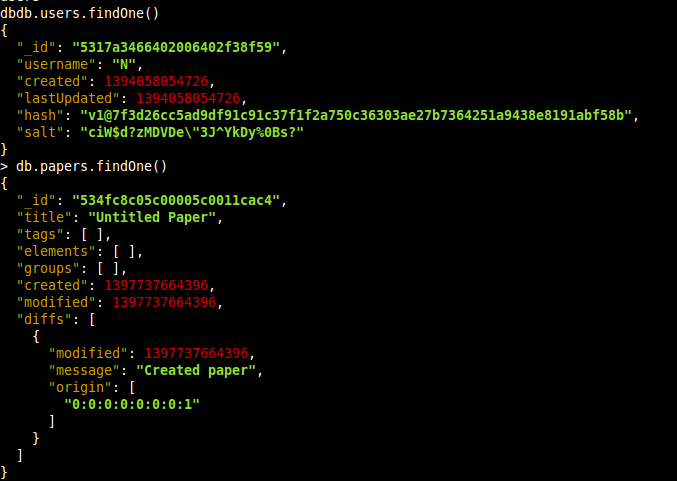

# Developer Documentation

Team8Paper is a rich internet application crafted in Javascript and jQuery on the client side, Scala on the server side, and MongoDB on the persistence side. These technologies were chosen due to familiarity by the 3 members in our team, and they are high performance technologies used to build modern web applications. From a high level, Team8Paper has a client-server architecture with clients sending requests to a stateless server by making HTTP calls. The stateless server uses an MVC architecture with packages controllers, models, and views organizing the source code. Between the client side and server side, JSON, REST, and non-blocking are three attributes emphasized in the design due to their simplicity. Input and outputs are JSON when possible, routes follow REST for easy communication, and server and client handles requests asynchronously so that the application exceeds at scaling. There exists two other packages which are services and util. Services contain functions that are closely tied to application such as a holding a database adapter. Util contains pure functions that help to refactor duplicate parts of code and are usually widely applicable such as generating UUIDs and ObjectIds.

# Architecture

The web application is built on top of Play!, a web framework, which manages resources and runs our application. All our code are loaded by Play!. On the client, we use Play Scala html templates to render views and link static assets. Public assets such as images, javascript and CSS resources are stored in assets or public folders. The assets folder
provides better management by using Google's closure compiler to optimize the javascript code in the directory. LESS, which is compatible with CSS,
and offers more features is the default used. LESS files are compiled to .min.css files by Play!. Libraries such as JQuery and Bootstrap which are already optimized, and images are stored in the public directory or linked externally, for static assets.



# Detailed Design

On the server, we depend on two libraries in addition to Play! which are Reactive Mongo and filters. Filters is a dependency used to create application wide conditionals to handle requests. Our application has 3 filters found in Global.scala and they run in order mentioned. The HttpsFilter ensures client is connected to application only through HTTPS on production. Next, the Api1Filter handles url paths beginning with /api1 with a json output to be consistent with valid /api1 calls instead of html responses such as 404 Not Found or Forbidden when accessing other parts of application. Lastly, the GzipFilter saves network bandwidth by compressing responses. ReactiveMongo is the sole database driver used for persisting users, papers, and all models used. We use a play-plugin which is a wrapper over ReactiveMongo for easier interoperability with Play's JSON models rather than dealing with converting between ReactiveMongo's BSON objects, case classes, and Play's JSON objects. With the play plugin, the data flows between case classes and JSON, and between JSON and BSON. An important feature of Reactive Mongo is that it is an asynchronous database driver. It is non-blocking, meaning calls with ReactiveMongo do no block other processes allowing maximum processor efficiency.

- Client-Server contract



- Standard Server response
```Javascript
// Server response
{
  status: 'success' // or 'error',
  data: 'any data type'
}
```

- Models



- Model Code



# Data Storage

On the persistence side, data are stored as BSON, similar more typed and compressed version of JSON, documents in MongoDB, a NoSQL database. Using a NoSQL database is simple and fits our design. We have two collections. The user collection stores user information. Then the paper collection stores individual papers, which is the central feature of our application. 

Document storage with MongoDB


# User Interface
We used the following libraries to quickly and efficiently build a seamless UI:
jQuery UI
Twitter Bootstrap
jQuery Tags Input
Bootstrap Font Awesome Icons
jQueury Multi Level Push Menu
jQuery Context Menu
Froala input editor

Our web application consists of two pages: The main page (index.html) and the paper page (/paper/:id)

Both pages contain a centralized navigation bar fixed to the right side of the screen for all
navigational links, editing options, persistence options, etc. The remainder of the page is reserved for
user content. Descriptions for the dynamic navbar are below depending on the page the user views.

Main page:
The main page has two subviews (home and dashboard).

    - Home page:
        As a project in development, it's important to present the user with a page that explains the
        crux of our web application. The content is self explanatory and doesn't add user functionality
        in any way. The information can be easily digested and contains all core information regarding
        basic functionality and background into the project.

        - Navbar:
            The navbar's first element (blue paper button) opens a hidden menu that pushes the entire view
            to the right. It gives the user quick access to paper options such as creating a new paper and
            viewing recent papers.
            The second group of buttons are for user persistence. Depending on whether the user is logged in
            or not, the button will show either the sign-in or the sign-off button. Selecting the sign-off
            button will instantly sign off the user. Selecting the sign on button will show a modal described
            below.

            - Sign in Modal:
                The sign in modal forces the attention of the user to a form requiring the user to enter their
                username and password. If they require an account, they can select the sign up link within the
                modal. The modal's form will change accordingly prompting the user for a username, password,
                and password verification.

            The third group of buttons include the following: search, home, dashboard. The last two are self
            explanatory. The search button will expose a hidden menu from the right of the screen allowing
            the user to search for papers they own via multiple tags. The results are shown within the same
            menu. The menu is scrollable.

    - Dashboard: The dashboard page
        The dashboard page allows the user to manage their existing papers. The main content of the page is
        occupied by the tiles that represent each paper. The user may click on the open button to be
        redirected to the paper or click on the tile itself. Clicking on the tile will expose the metadata
        of the selected paper to the fixed right hand section of the page reserved for displaying the metadata.
        The metadata include:
        Title
        Last Modified Date
        Created Date
        Tags

        The user may change the title and tags within the section. Once the user has made their changes,
        they can click on the Submit Changes button to apply the changes to the backend. Users may also
        duplicate and deleted the selected paper.


# User Documentation
User documentation is embedded in the web application. The learning curve should be low as a result of intuitive design and levels. Usage should be intuitive with different levels of usage from beginner to advanced. Answers can be found by poking around the application or by reading short descriptions associated with user actions.

- Levels
  1. Create a paper, click anywhere on screen to write
  2. Create tags, change title, rearrange elements and groups by dragging
  3. Embed rich media (images, videos), add elements to a group
  4. Future development (data visualizations, additional formatting, advanced sharing permissions, ...)
